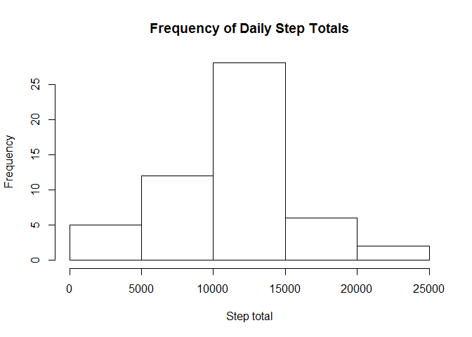
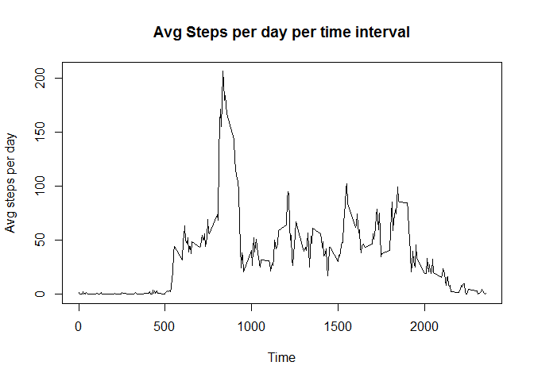
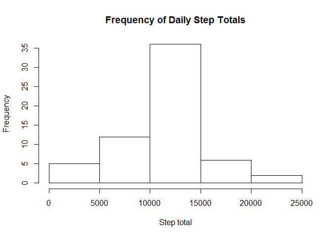
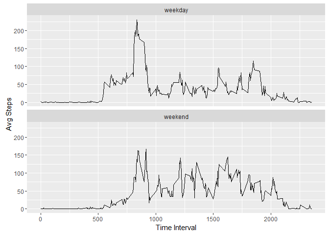

# Reproducible Research: Peer Assessment 1

 This assignment will be described in multiple parts. You will need to write a report that answers the questions detailed below. Ultimately, you will need to complete the entire assignment in a single R markdown document that can be processed by knitr and be transformed into an HTML file.

Throughout your report make sure you always include the code that you used to generate the output you present. When writing code chunks in the R markdown document, always use echo = TRUE so that someone else will be able to read the code. This assignment will be evaluated via peer assessment so it is essential that your peer evaluators be able to review the code for your analysis.

For the plotting aspects of this assignment, feel free to use any plotting system in R (i.e., base, lattice, ggplot2)

Fork/clone the GitHub repository created for this assignment. You will submit this assignment by pushing your completed files into your forked repository on GitHub. The assignment submission will consist of the URL to your GitHub repository and the SHA-1 commit ID for your repository state.

NOTE: The GitHub repository also contains the dataset for the assignment so you do not have to download the data separately.

## Loading and preprocessing the data

Show any code that is needed to

    Load the data (i.e. read.csv())
    Process/transform the data (if necessary) into a format suitable for your analysis


```r
#reads the csv
d<-read.csv("activity.csv")

#ignore na values
d_nomissing <- subset(d,d$steps!="NA")
```

## What is mean total number of steps taken per day?

For this part of the assignment, you can ignore the missing values in the dataset.

    Calculate the total number of steps taken per day

```r
byday<-aggregate(d_nomissing$steps,by=list(Date=d_nomissing$date),FUN=sum)
```
    
    If you do not understand the difference between a histogram and a barplot, research the difference between them. Make a histogram of the total number of steps taken each day

```r
hist(byday$x,main="Frequency of Daily Step Totals",xlab="Step total")
```


    
    
    Calculate and report the mean and median of the total number of steps taken per day


```r
meansteps<-mean(byday$x,na.rm=TRUE)
mediansteps<-median(byday$x,na.rm=TRUE)
print(paste("The mean number of steps is",meansteps))
```

```
## [1] "The mean number of steps is 10766.1886792453"
```

```r
print(paste("The median number of steps is",mediansteps))
```

```
## [1] "The median number of steps is 10765"
```


## What is the average daily activity pattern?

    Make a time series plot (i.e. type = "l") of the 5-minute interval (x-axis) and the average number of steps taken, averaged across all days (y-axis)


```r
mean_interval<-aggregate(d_nomissing$steps,by=list(Time=d_nomissing$interval),FUN=mean)
plot(mean_interval,type = "l",ylab="Avg steps per day",main="Avg Steps per day per time interval")
```


    Which 5-minute interval, on average across all the days in the dataset, contains the maximum number of steps?


```r
print(paste("The 5 minute interval with the maximum average number of steps is #",which(mean_interval$x==max(mean_interval$x))))
```

```
## [1] "The 5 minute interval with the maximum average number of steps is # 104"
```


## Imputing missing values

Note that there are a number of days/intervals where there are missing values (coded as NA). The presence of missing days may introduce bias into some calculations or summaries of the data.

    Calculate and report the total number of missing values in the dataset (i.e. the total number of rows with NAs)

```r
missing <- subset(d,is.na(d$steps))
count <-length(missing$steps)
print(paste("There are",count,"missing values in the dataset"))
```

```
## [1] "There are 2304 missing values in the dataset"
```
    
    
    Devise a strategy for filling in all of the missing values in the dataset. The strategy does not need to be sophisticated. For example, you could use the mean/median for that day, or the mean for that 5-minute interval, etc.
        
    Create a new dataset that is equal to the original dataset but with the missing data filled in.

```r
#Replace NA with mean daily values for that interval
merged<-merge(d,mean_interval,by.x="interval",by.y="Time")
merged$steps[is.na(merged$steps)]<-merged$x[is.na(merged$steps)]
#drop extra column
merged$x<-NULL
```

    Make a histogram of the total number of steps taken each day and Calculate and report the mean and median total number of steps taken per day. Do these values differ from the estimates from the first part of the assignment? What is the impact of imputing missing data on the estimates of the total daily number of steps?
    
By replacing NA values with the mean values for a given interval, the mean value for that interval remains unchanged.

```r
byday2<-aggregate(merged$steps,by=list(Date=merged$date),FUN=sum)


hist(byday2$x,main="Frequency of Daily Step Totals",xlab="Step total")
```



```r
meansteps2<-mean(byday2$x,na.rm=TRUE)
mediansteps2<-median(byday2$x,na.rm=TRUE)
print(paste("The mean number of steps with imputed values is",meansteps2,"compared to the original value of",meansteps))
```

```
## [1] "The mean number of steps with imputed values is 10766.1886792453 compared to the original value of 10766.1886792453"
```

```r
print(paste("The median number of steps with imputed values is",mediansteps2,"compared to the original value of",meansteps))
```

```
## [1] "The median number of steps with imputed values is 10766.1886792453 compared to the original value of 10766.1886792453"
```
By replacing NA values with the average values for a given interval, the mean and median values for that interval remains unchanged.  The frequency of the mean value has increased.

## Are there differences in activity patterns between weekdays and weekends?

For this part the weekdays() function may be of some help here. Use the dataset with the filled-in missing values for this part.

    Create a new factor variable in the dataset with two levels - "weekday" and "weekend" indicating whether a given date is a weekday or weekend day.
    Make a panel plot containing a time series plot (i.e. type = "l") of the 5-minute interval (x-axis) and the average number of steps taken, averaged across all weekday days or weekend days (y-axis). See the README file in the GitHub repository to see an example of what this plot should look like using simulated data.

```r
#default to weekday
merged$day<-"weekday"
#change sat and sun to weekend
merged$day[weekdays(as.Date(merged$date))=="Saturday" | weekdays(as.Date(merged$date))=="Sunday"]<-"weekend"
merged$day<-as.factor(merged$day)


byday3<-aggregate(merged$steps,by=list(interval=merged$interval,day=merged$day),FUN=mean)

library(ggplot2)
qplot(x=interval,y=x,data=byday3,geom="line",ylab="Avg Steps",xlab="Time Interval")+facet_wrap(~day,ncol=1)
```


